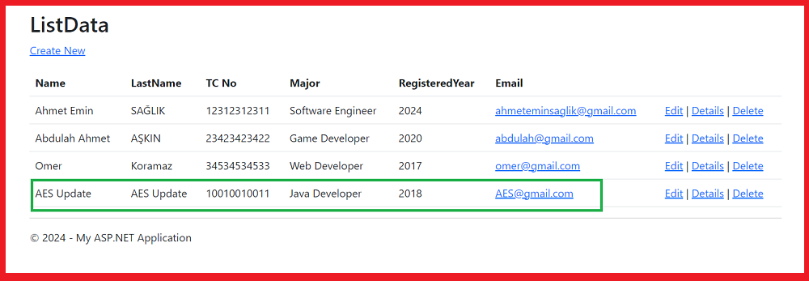
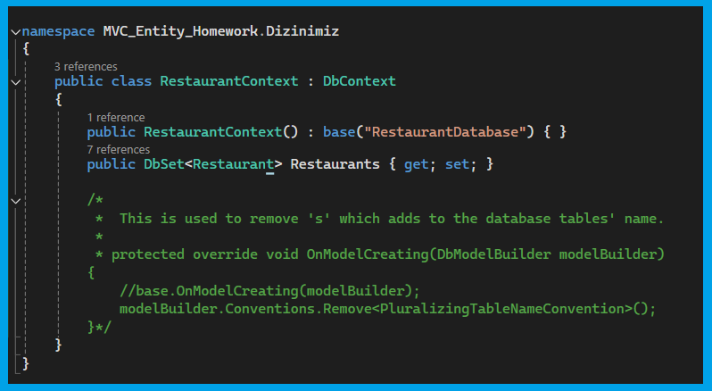
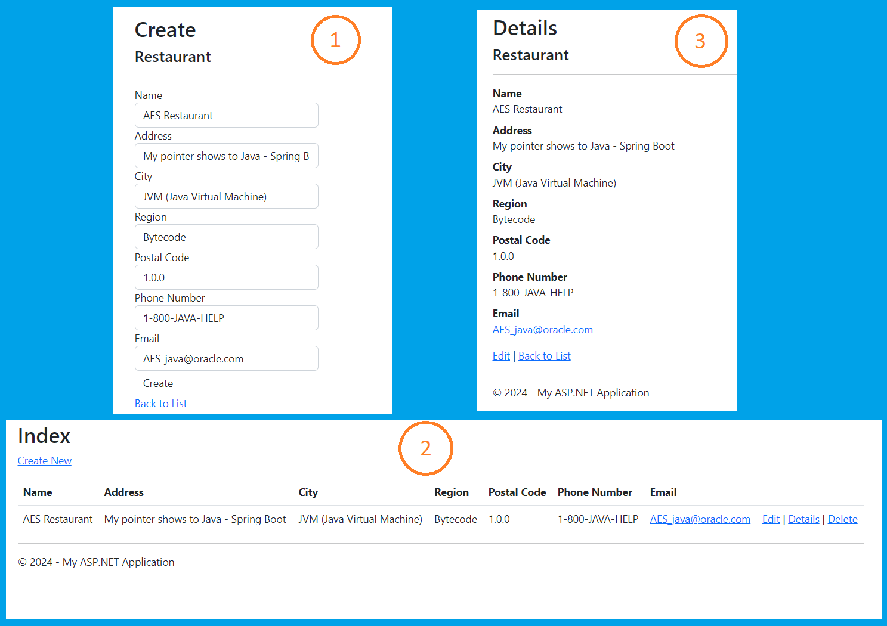

# *ASP.NET MVC Workshop*

## Preface

 &emsp; I would like to thank [Reha Çaputcu](https://www.linkedin.com/in/reha-caputcu-774b394) who was the mentor of the MVC workshop.  I gained an understanding of MVC architecture and applications thanks to the course content and your presentation. Also, I would like to thank the [Techcareer](https://www.techcareer.net) team for providing me with the opportunity to attend the [MVC Masterclass Workshop](https://www.techcareer.net/en/bootcamp/mvc-masterclass-workshop).

## Global Content

###  [Day 1:](#day-1) Laying the Foundation with MVC, Razor, and Data Annotations
###  [Day 2:](#day-2) HTTP Request Read-Created-Update
### [Day 3:](#day-3) HTTP Request Delete, Entity Framework
<br>


# Day 1 <a id="day-1"> </a>

<a id="#day-1"> </a><details>

<summary>  Click to see Detail </summary>


### Content :
1. [Key Learnings](#day-1-key-learnings)
2. [Images](#day-1-images)
 
 ## Key Learnings (Day-1)  <a id="day-1-key-learnings"></a>


* MVC (Model-View-Controller)
* Razor Technology
* Working with ASP.NET Framework
* Returning views from controllers
* Data annotation attributes:
  * Required
  * DisplayName
  * MinLength
  * MaxLength
  * EmailAddress


## Images (Day-1) <a id="day-1-images"></a>

 <br> <br>
 <br> <br>
 <br> <br>

</details>
<br>


# Day 2 <a id="day-2"> </a>


<details>

<summary>  Click to see Detail </summary>

### Content :

1. [Key Learnings](#day-2-key-learnings)
2. [Images](#day-2-images)
 
 ## Key Learnings (Day-2)  <a id="day-2-key-learnings"></a>


* Learned HTTP Request 
  * [HttpPost]
* Worked on Read, Create, Update processes on objects.


## Images (Day-2) <a id="day-2-images"></a>

 <br> <br>
 <br> <br>
 <br> <br>
 <br> <br>
 <br> <br>

</details>

<br>


# Day 3 <a id="day-3"> </a>

<a id="#day-3"> </a><details>

<summary>  Click to see Detail </summary>

### Content :
1. [Key Learnings](#day-3-key-learnings)
2. [Configure Web.config](#day-3-configure-web-config)
3. [Images](#day-3-images)


## Key Learnings (Day-3)  <a id="day-3-key-learnings"></a>


* Worked on Delete process on objects.
* What is Entity Framework? 
* How to use Entity Framework to realize CRUD process.
* DbContext
* Connection String
* How to configure Web.config to connect MsSql Server


## Configure Web.config   <a id="day-3-configure-web-config"> </a>
 Following xml data was added to **_Web.config_** file. Look for the ***\</entityFramework>*** and ***\</configuration>*** tags that usually are located to bottom of the file and positioned one after the other. Following data must be added between them. This configuration makes the project connecting MSSQL localhost server.

```xml
  <!--</entityFramework>-->
  <connectionStrings>
    <add name="RestaurantDatabase" 
		 connectionString="Data Source=.\SQLEXPRESS; Initial Catalog=Restaurant; Integrated Security=true;" 
		 providerName="System.Data.SqlClient"/>
  </connectionStrings>
  <!--</configuration> -->
```

## Images (Day-3) <a id="day-3-images"></a>

 <br> <br>
 <br> <br>
 <br> <br>

</details>