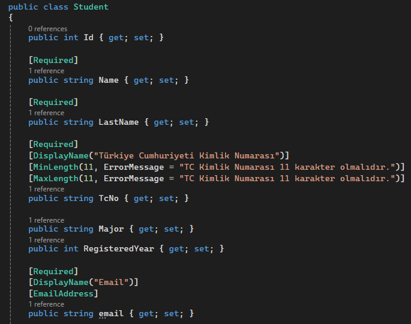
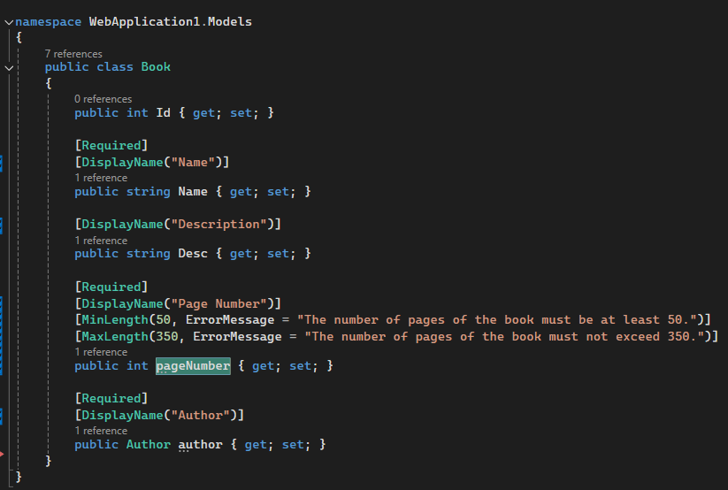
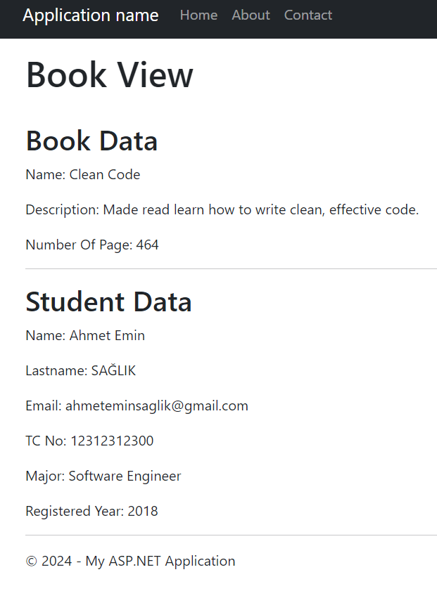
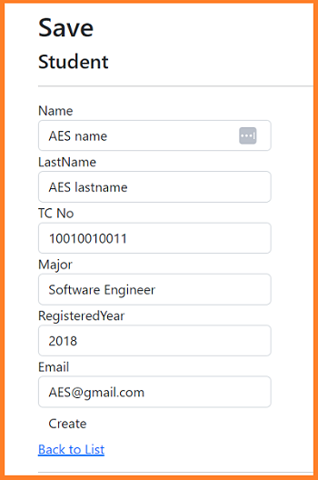
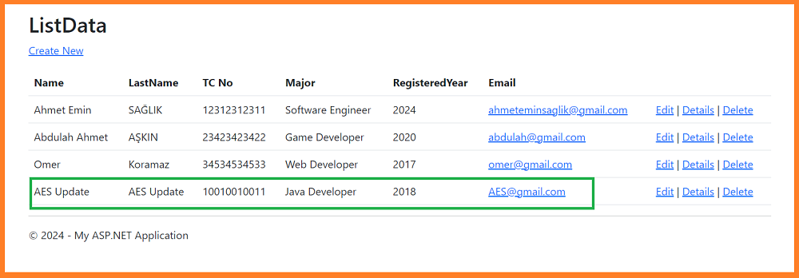

# *ASP.NET MVC Bootcamp*

## Global Content

###  [Day 1:](#day-1) Laying the Foundation with MVC, Razor, and Data Annotations
###  [Day 2:](#day-2) HTTP Request Read-Created-Update

 

# Day 1 

  Click to see Detail 

### Content :
1. [Key Learnings](#day-1-key-learnings)
2. [Images](#day-1-images)
 
 ## Key Learnings (Day-1)  

* MVC (Model-View-Controller)
* Razor Technology
* Working with ASP.NET Framework
* Returning views from controllers
* Data annotation attributes:
  * Required
  * DisplayName
  * MinLength
  * MaxLength
  * EmailAddress

## Images (Day-1) 

    
    
    

  

# Day 2 

  Click to see Detail 

### Content :

1. [Key Learnings](#day-2-key-learnings)
2. [Images](#day-2-images)
 
 ## Key Learnings (Day-2)  

* Learned HTTP Request 
  * [HttpPost]
* Worked on Read, Create, Update processes on objects.

## Images (Day-2) 

    
    
    
    
    

